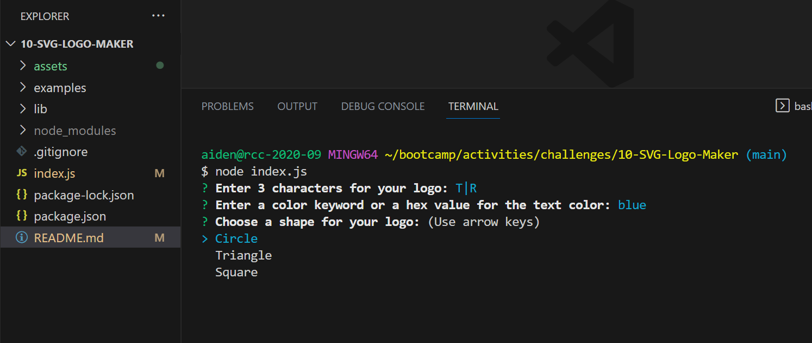
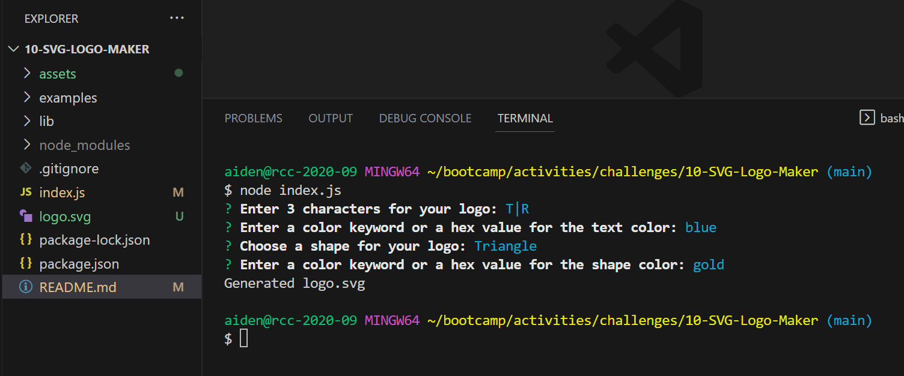
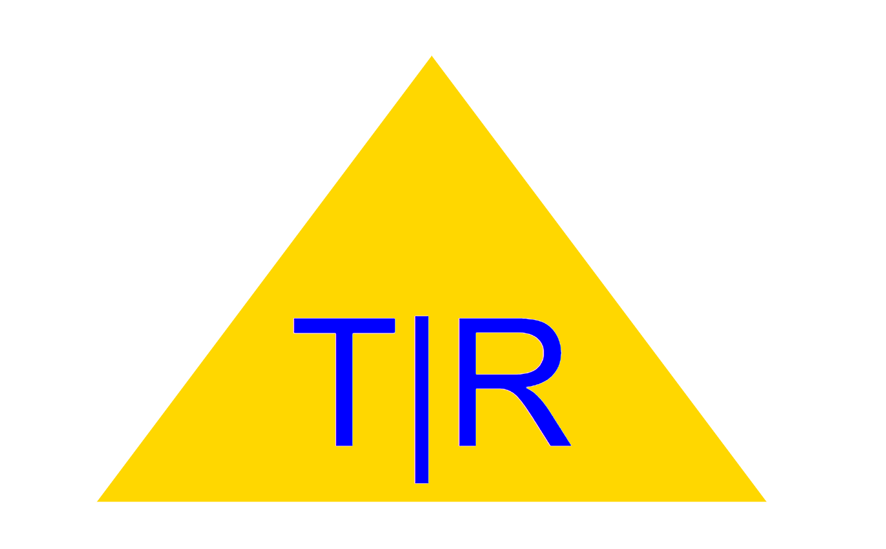

# 10-SVG-Logo-Maker
This is Rick's project to develop an SVG logo maker.

# Challenge-10 - Object-oriented Programming: SVG Logo Maker

## Description
The purpose of this project is to build a Node.js command-line application that takes in user input to generate a logo and save it as an SVG file. Acceptance Criteria have been broken down into individual features (e.g. AC01). For details on the implementation, review the applicable 'Usage' section of this README.

### User Story

* AS A freelance web developer
I WANT to generate a simple logo for my projects
SO THAT I don't have to pay a graphic designer

### Acceptance Criteria

>* GIVEN a command-line application that accepts user input

>* AC01: Logo Text Entry
>    -	WHEN I am prompted for text
>    -	THEN I can enter up to three characters

>* AC02: Logo Text Color Entry
>    -	WHEN I am prompted for the text color
>    -	THEN I can enter a color keyword (OR a hexadecimal number)

>* AC03: Logo Shape Selection
>    -	WHEN I am prompted for a shape
>    -	THEN I am presented with a list of shapes to choose from: circle, triangle, and square

>* AC04: Logo Shape Color
>    -	WHEN I am prompted for the shape's color
>    -	THEN I can enter a color keyword (OR a hexadecimal number)

>* AC05: SVG File Generation and Message Output 
>    -	WHEN I have entered input for all the prompts
>    -	THEN an SVG file is created named `logo.svg`
AND the output text "Generated logo.svg" is printed in the command line

>* AC06: SVG File Requirements 
>    -	WHEN I open the `logo.svg` file in a browser
>    -	THEN I am shown a 300x200 pixel image that matches the criteria I entered

## Installation

> * To watch a video showing the application in use, open the browser and paste the following URL in the address bar, or click on the link: https://watch.screencastify.com/v/3ld63bqd0t60nh5eCyju
> * To access the project repo, open the browser and paste the following URL in the address bar, or click on the link: https://github.com/recenasu/10-SVG-Logo-Maker

## Usage

> * From VSCode, open a terminal window
> * Navigate to the project root directory using bash
> * Type 'node index.js'
> * Press Enter
> * Answer each prompt by typing your answer or selecting an option from the menu, when applicable (AC01) (AC02) (AC03) (AC04)
> * After answering the final prompt, wait for the message that the logo.svg file has been generated (AC05)
> * Open the newly created "logo.svg" file in the browser (AC06)
> * The examples folder (./examples) in the project root directory contains sample logos generated using this application. 

The following images show the application sequence and a sample file.

> * Initial prompts

> * logo.svg file creation

> * logo displayed in browser

## Credits

> * npm Inquirer v8.2.6 module was used for the user prompt functionality.
> * npm Jest v24.9.0 module was used for testing the render() functions.

